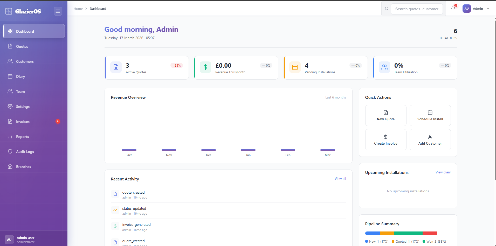

# Hydron Applications — Static Website

Production-ready static website for **Hydron Applications**, a technical prototype studio.
Deployed on GitHub Pages at [hydronapplications.com](https://hydronapplications.com).

---

## File Structure

```
├── index.html          # Single-page site (all sections)
├── styles.css          # Premium dark responsive stylesheet
├── script.js           # Smooth scroll, nav, form handling, animations
├── robots.txt          # SEO robots directive
├── sitemap.xml         # SEO sitemap
├── assets/
│   ├── images/         # Place screenshot/image files here
│   └── icons/          # Place icon files here
└── README.md           # This file
```

---

## Deployment on GitHub Pages

### 1. Repository settings

1. Go to your repository on GitHub
2. Navigate to **Settings → Pages**
3. Under **Source**, select **Deploy from a branch**
4. Select the `main` branch and `/ (root)` folder
5. Click **Save**

The site will be live at `https://<your-username>.github.io/<repo-name>/` within a few minutes.

### 2. Custom domain (hydronapplications.com)

1. In **Settings → Pages**, add `hydronapplications.com` in the **Custom domain** field
2. With your DNS provider, add the following records:

   | Type  | Host | Value                  |
   |-------|------|------------------------|
   | A     | @    | 185.199.108.153        |
   | A     | @    | 185.199.109.153        |
   | A     | @    | 185.199.110.153        |
   | A     | @    | 185.199.111.153        |
   | CNAME | www  | `<username>.github.io` |

3. Enable **Enforce HTTPS** once DNS has propagated (may take up to 48 hours)

---

## What to Replace Before Going Live

### Formspree contact form

Open `index.html` and find:

```html
action="https://formspree.io/f/YOUR_FORM_ID"
```

Replace `YOUR_FORM_ID` with your actual form ID from [formspree.io](https://formspree.io).

### Contact email

The placeholder email `hello@hydronapplications.com` appears in:
- `index.html` — contact section and footer
- `script.js` — form error fallback message

Replace all instances with your real contact email.

### Social / profile links

In the footer section of `index.html`, find:

```html
<a href="https://github.com" ...>GitHub</a>
<a href="https://linkedin.com" ...>LinkedIn</a>
```

Replace with your actual profile URLs.

### Placeholder images

Add real screenshot images to `assets/images/` matching these filenames:

| Filename                  | Used in case study         |
|---------------------------|---------------------------|
| `glazieros-dashboard.png` | GlazierOS                 |
| `glazieros-customers.png` | GlazierOS                 |
| `glazieros-quotes.png`    | GlazierOS                 |
| `world-of-light.png`      | World of Light            |
| `words-of-power-wheel.png`| Words of Power            |
| `altfindr-home.png`       | AltFindr                  |
| `lead-scraper.png`        | Google Maps Lead Scraper  |
| `trading-terminal.png`    | Trading Automation System |
| `trading-report.png`      | Trading Automation System |

The HTML uses `<div class="img-placeholder">` elements as stand-ins.
When ready to replace them with real `` tags, use this pattern:

```html

```

---

## SEO Notes

- `robots.txt` allows all crawlers and references the sitemap
- `sitemap.xml` points to `https://hydronapplications.com/`
- Update `<lastmod>` in `sitemap.xml` after significant content changes
- Open Graph and Twitter Card meta tags are in the `<head>` of `index.html`
- Replace the `og:image` placeholder path with an actual 1200×630 social preview image

---

## Local Development

No build step is required — the site is plain HTML, CSS, and JavaScript.

```bash
# Serve locally with Python (any modern version)
python3 -m http.server 8080

# Or with Node.js (npx)
npx serve .
```

Then open `http://localhost:8080` in your browser.
